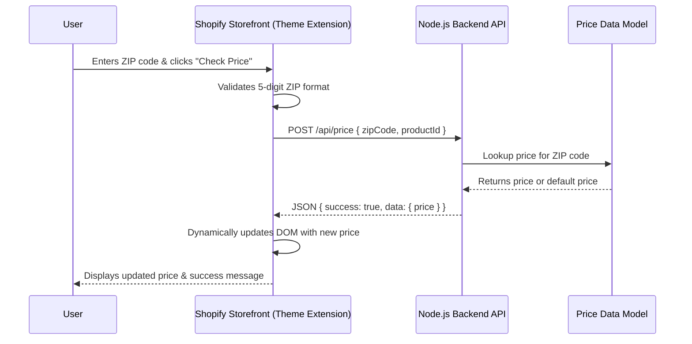

# ZIP Code Price Checker

## Project Overview
This project provides a robust, dynamic Shopify Theme App Extension that displays a custom product price based on a user's ZIP code. The solution seamlessly integrates into any modern Shopify theme using Theme App Extensions without modifying core theme code.

It consists of two main components:
1. **Shopify Theme App Extension:** A frontend widget that collects a 5-digit ZIP code, handles client-side validation, and manages loading states.
2. **Node.js/Express Backend:** A serverless API (deployed on Vercel) that evaluates the requested ZIP code and serves custom pricing logic.

## Features
- Shopify Theme App Extension
- ZIP code validation
- Dynamic pricing lookup
- REST API integration
- MVC backend architecture
- Vercel deployment
- Responsive widget

## Tech Stack

### Frontend
- Shopify Theme App Extension
- Liquid
- JavaScript

### Backend
- Node.js
- Express.js
- MVC Architecture
- Vercel

### APIs
- Shopify Theme App Extensions
- REST API

## Architecture Diagram



## Backend Architecture

The backend follows the MVC pattern:

Routes
→ Controller
→ Service
→ Model

The pricing logic is isolated in the Service/Model layer, allowing the hardcoded ZIP table to be replaced by a database or pricing engine without changing the API contract.

## Project Structure

```text
assignment_shopfy/
├── backend/
│   ├── src/
│   │   ├── controllers/
│   │   ├── services/
│   │   ├── models/
│   │   └── routes/
│   └── server.js
│
└── shopify-app/
    └── zip-price-demo/
        └── extensions/
            └── zip-price/
```

## Setup Instructions

### Backend
1. Navigate to the `backend` directory: `cd backend`
2. Install dependencies: `npm install`
3. Run the development server: `npm run dev`
4. The backend is configured for deployment on Vercel via `vercel.json`.

### Shopify Theme Extension
1. Navigate to the extension directory: `cd shopify-app/zip-price-demo`
2. Install dependencies: `npm install`
3. Run the development server to connect to your store: `shopify app dev`
4. Deploy to your Shopify Partner account: `npm run deploy`
5. Go to the Shopify Theme Editor for your store, navigate to the Product template, and add the **ZIP Price Checker** block.

## Backend URL
`https://shopify-zipcode-pricing-demo-wj6w.vercel.app`

## API Endpoint
**Endpoint:** `POST /api/price`

**Headers:**
```json
{
  "Content-Type": "application/json"
}
```

**Request Body:**
```json
{
  "zipCode": "10001",
  "productId": "123456789"
}
```

**Success Response (200 OK):**
```json
{
  "success": true,
  "data": {
    "productId": "123456789",
    "zipCode": "10001",
    "price": 1699
  }
}
```

## Test ZIP Codes
- **`75028`** ➡️ Price: $1499
- **`10001`** ➡️ Price: $1699
- **`90210`** ➡️ Price: $1799
- **Any other valid 5-digit ZIP code** ➡️ Defaults to: $1499

## Screenshots

### Product Page


### ZIP Price Result

